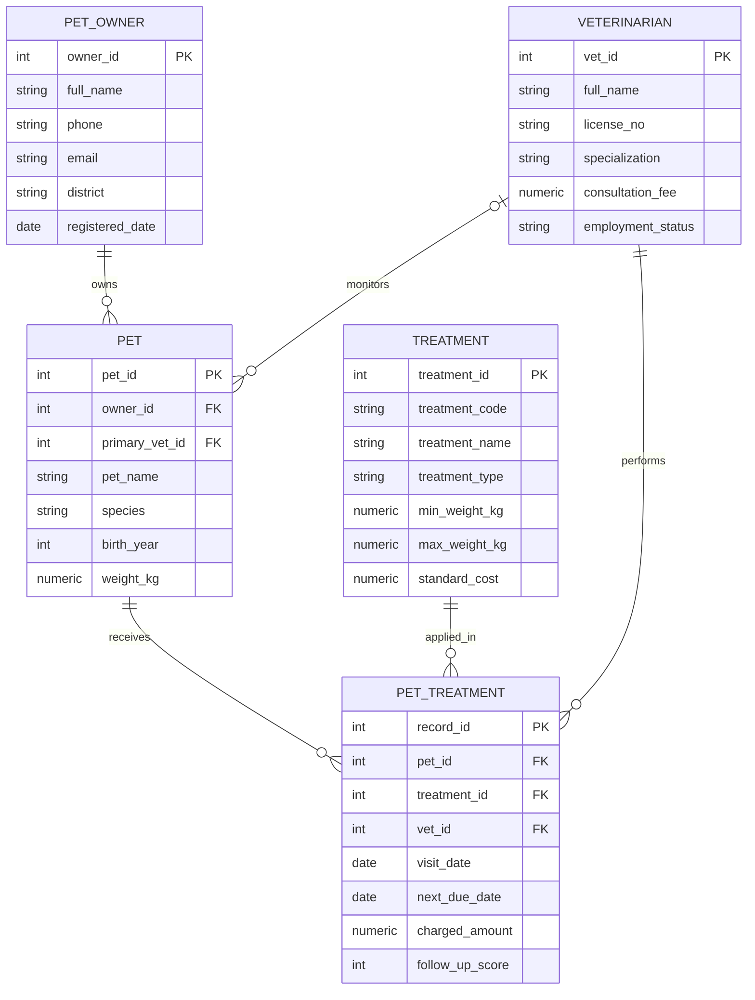

# ER Diyagramı — Veteriner Kliniği Evcil Hayvan ve Aşı/Tedavi Takip Sistemi

```mermaid
erDiagram
    PET_OWNER ||--o{ PET : "owns"
    VETERINARIAN |o--o{ PET : "monitors"
    PET ||--o{ PET_TREATMENT : "receives"
    TREATMENT ||--o{ PET_TREATMENT : "applied_in"
    VETERINARIAN ||--o{ PET_TREATMENT : "performs"

    PET_OWNER {
        int owner_id PK
        string full_name
        string phone
        string email
        string district
        date registered_date
    }

    VETERINARIAN {
        int vet_id PK
        string full_name
        string license_no
        string specialization
        numeric consultation_fee
        string employment_status
    }

    PET {
        int pet_id PK
        int owner_id FK
        int primary_vet_id FK
        string pet_name
        string species
        int birth_year
        numeric weight_kg
    }

    TREATMENT {
        int treatment_id PK
        string treatment_code
        string treatment_name
        string treatment_type
        numeric min_weight_kg
        numeric max_weight_kg
        numeric standard_cost
    }

    PET_TREATMENT {
        int record_id PK
        int pet_id FK
        int treatment_id FK
        int vet_id FK
        date visit_date
        date next_due_date
        numeric charged_amount
        int follow_up_score
    }
```
