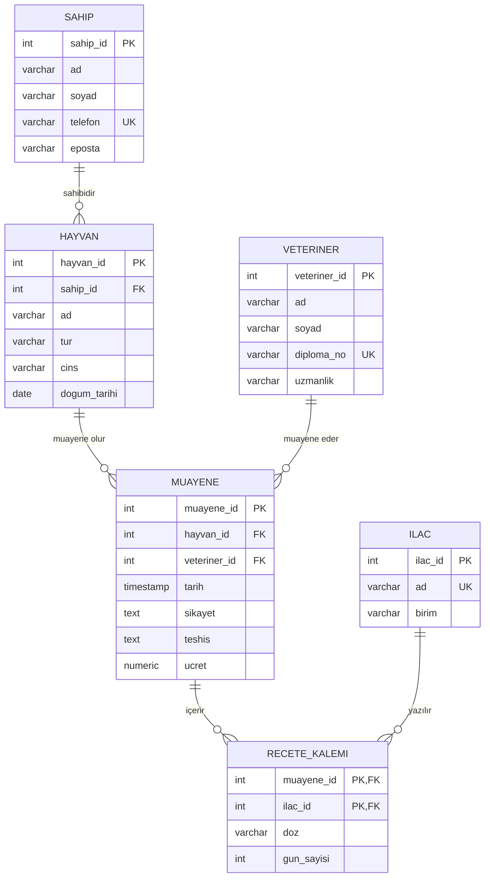

```mermaid
erDiagram
    SAHIP ||--o{ HAYVAN : "sahibidir"
    HAYVAN ||--o{ MUAYENE : "muayene olur"
    VETERINER ||--o{ MUAYENE : "muayene eder"
    MUAYENE ||--o{ RECETE_KALEMI : "içerir"
    ILAC ||--o{ RECETE_KALEMI : "yazılır"

    SAHIP {
        int sahip_id PK
        varchar ad
        varchar soyad
        varchar telefon UK
        varchar eposta
    }
    HAYVAN {
        int hayvan_id PK
        int sahip_id FK
        varchar ad
        varchar tur
        varchar cins
        date dogum_tarihi
    }
    VETERINER {
        int veteriner_id PK
        varchar ad
        varchar soyad
        varchar diploma_no UK
        varchar uzmanlik
    }
    MUAYENE {
        int muayene_id PK
        int hayvan_id FK
        int veteriner_id FK
        timestamp tarih
        text sikayet
        text teshis
        numeric ucret
    }
    ILAC {
        int ilac_id PK
        varchar ad UK
        varchar birim
    }
    RECETE_KALEMI {
        int muayene_id PK,FK
        int ilac_id PK,FK
        varchar doz
        int gun_sayisi
    }
```